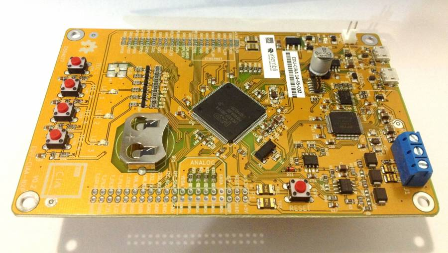
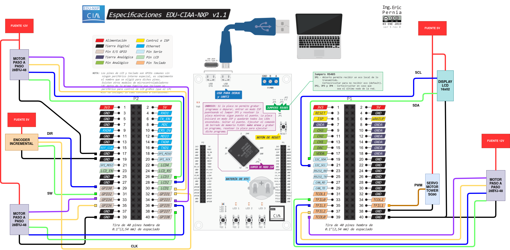
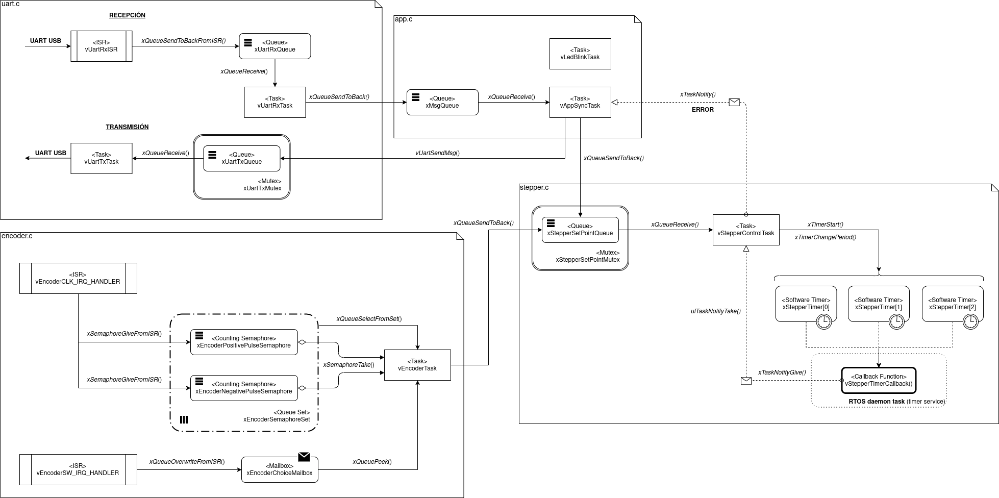

# RTOS en placa de desarrollo EDU-CIAA para el control de un accionamiento electromecánico básico

El objetivo del trabajo es la implementación de una aplicación basada en el sistema operativo de tiempo real FreeRTOS, sobre la placa de desarrollo EDU-CIAA, para el control de un sistema electromecánico básico que tiene como fin únicamente la demostración visual de lo que sucede en la electrónica. Se busca implementar todos los conceptos fundamentales de FreeRTOS, basándose en el libro *Mastering the FreeRTOS Real Time Kernel*, por más que algunos de estos conceptos tengan una aplicación forzada y se alejen de lo práctico o lo más conveniente. Esto es porque la principal finalidad del proyecto es aprender a utilizar FreeRTOS por sobre obtener un controlador del sistema con buen criterio de diseño y eficiente.

Además, el proyecto también busca una introducción al flujo de trabajo del proyecto CIAA (Computadora Industrial Abierta Argentina). Salvo algunas excepciones, no se profundizó en la programación de los microcontroladores a nivel de registros, sino que se utilizó la capa de abstracción proveída por la librería sAPI, incluida en el firmware de dicho proyecto CIAA.

## Software y hardware utilizado
El proyecto se basa en el firmware del proyecto CIAA en su versión 3, se puede obtener más información en su [repositorio en Github](https://github.com/epernia/firmware_v3). El código fuente del firmware con todos sus ejemplos se encuentra como carpeta en este proyecto.

El trabajo consiste en el movimiento controlado del robot EEZYBOTARM MK3 publicado por EEZY robots y diseñado por Carlo Franciscone. 

 

Por lo tanto, además de la EDU-CIAA el hardware necesario son:

- 3 motores paso a paso monopolares 28BYJ-48 con drivers ULN2003.
- Un servomotor Tower Pro SG90 (extremo operativo del robot).
- Un display LCD 16x02 (no se utilizó comunicación I2C, sino conexión directa mediante interfaz de 4 bits).
- Un encoder rotativo incremental con pulsador como interfaz de entrada del usuario.

## ¿Cómo utilizar?
Para compilar el código solo es necesario ejecutar el comando `make` dentro de la carpeta del repositorio. Para subir a la placa EDU-CIAA el proyecto, ejecutar el comando `make download`. Si esto último da error remitirse a la documentación del firmware o contactarme para solucionarlo (el problema puede llegar a ser de permisos del sistema).

La conexión del hardware debe se describe en la siguiente imagen de forma simplificada (Como trabajo a futuro es necesario clarificar esta imagen e incorporar las PCB diseñadas):

## Estructura del proyecto
En la siguiente imagen se  puede observar de forma simplificada la estructura que presenta el código del proyecto, los diferentes módulos y la forma en que se comunican entre sí.

Para información más detallada, ir al [informe](docs/informe/main.pdf) presentado del trabajo.

## Contribuir
El proyecto ya fue presentado, sin embargo, como todos mis proyectos sigue abierto a recomendaciones, críticas o cambios que parezcan oportunos a cualquier interesado. Para proponer alguna modificación sencillamente deben contactarme a mi mail o redes sociales, o directamente hacer un *pull-request* con los cambios que se desean realizar. Será un placer intercambiar opiniones y agregar al proyecto cualquier mejora por mínima que sea.

### Estilo de código
La escritura del código en C sigue los lineamientos de FreeRTOS que se encuentran en el libro *Mastering the freeRTOS Real Time Kernel*, para el nombre de funciones, variables, definiciones, etc. En cuánto a los comentarios y toda la documentación externa al código en sí, se siguió el proyecto Doxygen.

## Créditos
Es importante agradecer a Eric Pernia, uno de los desarrolladores del firmware de la placa EDU-CIAA que solucionó dudas mientras me iniciaba con la placa de desarrollo. El proyecto fue desarrollado para la cátedra Microcontroladores y Electrónica de Potencia de la Facultad de Ingeniería de la Universidad Nacional de Cuyo. El profesor Ing. Eduardo Iriarte salvó muchísimas dudas tanto de electrónica, específicas de la placa EDU-CIAA y conceptuales de RTOS y programación de sistemas embebidos en C.

## Licencia 
MIT © Gonzalo G. Fernández
